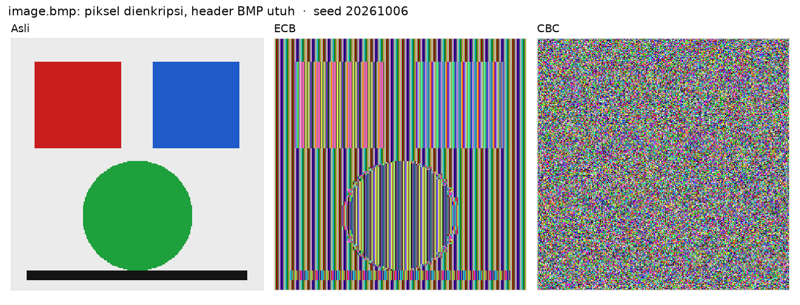
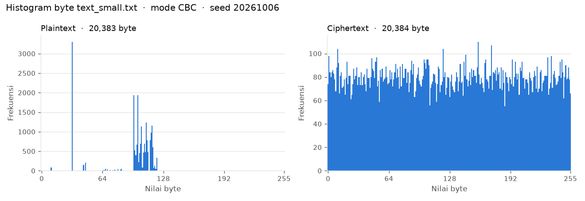
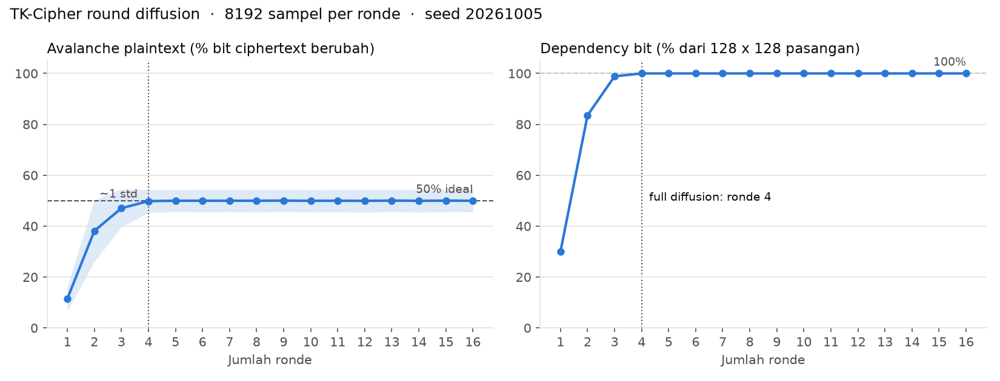

<div align="center">
   
</div>

<div align="center">

   
   
   
   
   
   
   

</div>

---

## About

TK-Cipher adalah block cipher **Substitution-Permutation Network (SPN) 128-bit** buatan sendiri, lengkap dengan program enkripsi dan dekripsi file. Program mendukung 5 mode operasi (ECB, CBC, CFB, OFB, CTR), padding PKCS#7, dan integritas Encrypt-then-MAC. Semua bagian kriptografi ditulis dari nol tanpa library crypto, untuk Tugas 2 IF4020 Kriptografi ITB.

---

## Features

- **Block cipher SPN 128-bit**
  Master key 128, 192, atau 256-bit, 16 ronde plus whitening, dengan 17 round key unik dari key schedule sendiri.

- **S-box dinamis per key**
  S-box dibangkitkan dari key lewat PRNG ARX buatan sendiri (`TKRand`) dan Fisher-Yates shuffle, lalu disaring sampai differential uniformity <= 12 dan nonlinearity >= 90. Bukan S-box AES.

- **Round function sendiri**
  AddRoundKey, DiagonalTranspose (transposisi), DynamicSub (substitusi), RowRotator (rotasi bit per baris), dan ColumnCascade (penjumlahan mod 256 berantai per kolom).

- **5 mode operasi**
  ECB, CBC, CFB, OFB, dan CTR ditulis dari nol. IV atau counter awal dibuat acak kalau tidak diberikan.

- **Encrypt-then-MAC**
  KDF sendiri menurunkan key enkripsi dan key MAC terpisah, tag dihitung pakai CMAC-TK, dan tag diverifikasi constant time **sebelum** dekripsi. Key salah atau file yang diubah ditolak tanpa menulis plaintext.

- **Format file self-describing**
  Header berisi magic, versi, mode, IV, dan panjang asli, jadi dekripsi cukup butuh file dan key.

- **CLI dan executable**
  Perintah `tk-cipher enc`, `dec`, dan `keygen`, plus executable single file untuk Linux dan Windows yang jalan tanpa Python.

- **Analisis keamanan**
  Avalanche plaintext dan key, round diffusion, entropi, chi-square, histogram, visual ECB vs CBC, dan statistik S-box di kelima mode.

---

## Tech Stack

| Layer | Technology |
|:---|:---|
| Language | Python 3.10+ (dikembangkan di 3.14) |
| Jalur cipher | Standard library saja, tanpa `hashlib`, `hmac`, `random`, `secrets`, atau library crypto apa pun |
| CLI | `argparse` |
| Package manager | uv |
| Testing | pytest + doctest |
| Analisis | numpy, matplotlib (hanya di `analysis/`) |
| API docs | pdoc, di-host di GitHub Pages |
| Executable | PyInstaller |
| CI | GitHub Actions (ruff + pytest di Linux dan Windows) |

### Dependensi

| Group | Paket | Dipakai untuk |
|:---|:---|:---|
| runtime | tidak ada | cipher, mode, padding, KDF, MAC, CLI |
| `dev` | pytest, pdoc, pyinstaller, ruff | test, API docs, executable, lint |
| `analysis` | numpy, matplotlib | skrip di `analysis/` |

Semua dependency dikelola uv lewat `pyproject.toml` dan `uv.lock`.

---

## Screenshots

<div align="center">

### Hasil Analisis

**ECB vs CBC**

Piksel `image.bmp` dienkripsi dengan header BMP tetap utuh. Pola gambar masih kelihatan di ECB dan hilang total di CBC.



<br/>

**Histogram byte**

Frekuensi byte teks plaintext yang timpang menjadi rata setelah dienkripsi dengan CBC.



<br/>

**Round diffusion**

Avalanche dan dependency bit per jumlah ronde. Full diffusion tercapai di ronde 4, jadi 16 ronde memberi margin 4x.



</div>

---

## Setup and Run

> **Prerequisites:** Python 3.10 atau lebih baru dan [uv](https://docs.astral.sh/uv/). Kalau cuma mau pakai executable, tidak perlu keduanya.

### Clone the repository

```bash
git clone https://github.com/filbertengyo/tk_cipher.git
cd tk_cipher
uv sync
```

### Bikin key

```bash
uv run tk-cipher keygen                 # 128-bit, 32 karakter hex
uv run tk-cipher keygen --bits 256      # 192 atau 256-bit juga bisa
uv run tk-cipher keygen > key.txt       # simpan ke file biar key tidak masuk shell history
```

### Enkripsi dan dekripsi tiap mode

Key bisa lewat `-k <hex>` atau `--key-file <path>`. Mode dan IV ikut tersimpan di file, jadi `dec` cukup butuh file dan key.

```bash
# ECB (tanpa IV)
uv run tk-cipher enc -i tests/data/text_small.txt -o out.ecb -m ecb --key-file key.txt
uv run tk-cipher dec -i out.ecb -o back.txt --key-file key.txt

# CBC (IV acak otomatis, dicetak ke stderr)
uv run tk-cipher enc -i tests/data/image.bmp -o out.cbc -m cbc --key-file key.txt
uv run tk-cipher dec -i out.cbc -o back.bmp --key-file key.txt

# CFB dengan IV manual (32 karakter hex)
uv run tk-cipher enc -i tests/data/binary.png -o out.cfb -m cfb --key-file key.txt --iv 000102030405060708090a0b0c0d0e0f
uv run tk-cipher dec -i out.cfb -o back.png --key-file key.txt

# OFB
uv run tk-cipher enc -i tests/data/repetitive.bin -o out.ofb -m ofb --key-file key.txt
uv run tk-cipher dec -i out.ofb -o back.bin --key-file key.txt

# CTR (--iv artinya counter awal)
uv run tk-cipher enc -i tests/data/text_small.txt -o out.ctr -m ctr -k 00112233445566778899aabbccddeeff --iv 00000000000000000000000000000001
uv run tk-cipher dec -i out.ctr -o back.txt -k 00112233445566778899aabbccddeeff
```

`python -m tk_cipher ...` sama dengan `tk-cipher ...`.

> **Peringatan:** jangan pakai ulang IV atau counter yang sama dengan key yang sama di mode **OFB** dan **CTR**. Keystream-nya jadi sama dan XOR dua ciphertext langsung membocorkan XOR dua plaintext. Biarkan `--iv` kosong supaya IV dibuat acak.

### Exit code

| Code | Arti |
|:---:|:---|
| 0 | Sukses |
| 1 | Argumen salah, key invalid, file input tidak ada, atau `-o` sama dengan `-i` |
| 2 | File ciphertext rusak (`InvalidFormatError` atau `PaddingError`) |
| 3 | MAC gagal: key salah atau file sudah diubah (`AuthenticationError`) |

### Executable tanpa Python

| OS | Download |
|:---|:---|
| Linux | [`dist/tk-cipher-linux`](https://github.com/filbertengyo/tk_cipher/raw/main/dist/tk-cipher-linux) |
| Windows | [`dist/tk-cipher-windows.exe`](https://github.com/filbertengyo/tk_cipher/raw/main/dist/tk-cipher-windows.exe) |

```bash
chmod +x dist/tk-cipher-linux
./dist/tk-cipher-linux enc -i tests/data/text_small.txt -o out.enc -m cbc --key-file key.txt
```

```powershell
.\dist\tk-cipher-windows.exe enc -i tests\data\text_small.txt -o out.enc -m cbc --key-file key.txt
```

Build ulang executable ada di [`docs/build_exe.md`](docs/build_exe.md), atau jalankan workflow `build-exe` di tab Actions.

### Test dan analisis

```bash
uv sync --all-groups
uv run pytest -m "not slow"                  # unit, integration ringan, dan doctest
uv run pytest                                 # termasuk test slow (file besar)
uv run python tests/data/make_large.py        # bikin tests/data/large.bin 5 MiB

uv run python analysis/avalanche.py           # avalanche plaintext dan key, 5 mode
uv run python analysis/round_diffusion.py     # justifikasi 16 ronde
uv run python analysis/entropy.py             # entropi dan chi-square
uv run python analysis/histogram.py           # histogram dan visual ECB vs CBC
uv run python analysis/sbox_stats.py          # statistik S-box
uv run python analysis/benchmark.py           # throughput dan key setup
uv run python analysis/run_all.py             # semua analisis di atas sekaligus
```

Hasil analisis tersimpan di [`tests/results/`](tests/results/).

---

## Ringkasan Desain

| Parameter | Nilai |
|:---|:---|
| Struktur | SPN, state matriks 4x4 byte |
| Ukuran blok | 128 bit |
| Ukuran key | 128, 192, atau 256 bit |
| Ronde | 16 ronde + whitening akhir (17 round key) |
| Satu ronde | AddRoundKey, DiagonalTranspose, DynamicSub, RowRotator, ColumnCascade |
| Integritas | KDF sendiri + CMAC-TK, Encrypt-then-MAC |

Bentuk state 4x4 terinspirasi AES, tapi komponennya beda: S-box dinamis per key (bukan S-box statis GF(2^8)), transpose matriks (bukan ShiftRows), dan pencampuran lewat rotasi bit serta penjumlahan modular (bukan MixColumns). Penjelasan lengkap, alasan desain, dan diagram ada di [`docs/DESIGN.md`](docs/DESIGN.md).

---

## API docs

Dokumentasi API dibuat dari docstring dan type hints di `src/tk_cipher/` pakai [pdoc](https://pdoc.dev). Isinya deskripsi tiap modul, kelas, dan fungsi publik, parameter beserta tipe data, return, exception, contoh pemakaian, dan catatan.

Link: <https://filbertengyo.github.io/tk_cipher/api/>

### Tools

- **pdoc**: generate HTML statis dari docstring format Google (`Args`, `Returns`, `Raises`, `Example`, `Note`). Ada di dependency group `dev`.
- **GitHub Pages**: repo menyajikan folder `docs/` di branch `main`, jadi HTML hasil pdoc disimpan di `docs/api/` dan langsung terbit setelah merge, tanpa server backend.
- **Tema**: `tools/pdoc/theme.css` dan `custom.css` mengganti warna, font, dan sudut kotak tampilan bawaan pdoc.
- **Doctest**: semua contoh di docstring ikut dijalankan `uv run pytest` (`--doctest-modules`), jadi contoh di docs selalu sesuai kode.

### Build ulang

```bash
uv sync --all-groups
uv run pdoc --docformat google -t tools/pdoc --footer-text "TK-Cipher 0.1.0" -o docs/api tk_cipher
```

Buka `docs/api/index.html` di browser buat lihat hasilnya. Setiap kali docstring berubah, build ulang lalu commit `docs/api/` supaya halaman online ikut ter-update.

---

## Project Structure

```
tk_cipher/
├── src/tk_cipher/        # cipher, key schedule, S-box, mode, padding, KDF, MAC, format file, CLI
├── tests/
│   ├── data/             # sample input kecil, sedang, besar
│   ├── results/          # hasil analisis (CSV, ringkasan, PNG)
│   └── test_*.py         # unit dan integration test
├── analysis/             # skrip avalanche, diffusion, entropi, histogram, S-box
├── docs/
│   ├── DESIGN.md         # desain dan alasannya
│   ├── diagrams/         # diagram Mermaid
│   ├── api/              # API docs hasil pdoc (GitHub Pages)
│   └── build_exe.md      # cara build executable
├── tools/pdoc/           # tema API docs
├── dist/                 # executable Linux dan Windows
├── tk-cipher.spec        # spec PyInstaller
└── pyproject.toml
```

---

## Authors

<div align="center">

| NIM | Name | Contribution |
|:---:|:---|:---|
| 13523126 | Brian Ricardo Tamin | - Desain awal cipher<br>- Operasi ronde dan inverse<br>- CLI dan executable<br>- API docs dan README |
| 13523154 | Theo Kurniady | - KDF dan CMAC-TK<br>- Format file verify-then-decrypt<br>- Key schedule<br>- Integration dan E2E test |
| 13523161 | Arlow Emmanuel Hergara | - Padding PKCS#7<br>- Mode ECB, CBC, CFB, OFB, CTR<br>- Analisis avalanche dan histogram<br>- Benchmark |
| 13523163 | Filbert Engyo | - PRNG TKRand dan S-box dinamis<br>- Enkripsi dan dekripsi blok dan test vector<br>- Analisis round diffusion dan statistik S-box<br>- Analisis entropi dan chi-square |

</div>

---

<div align="center">
   
</div>
