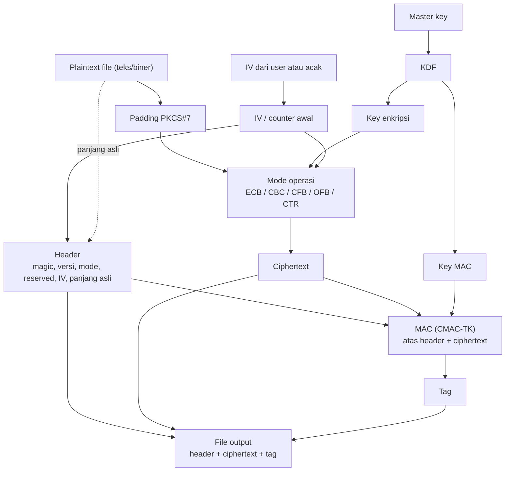
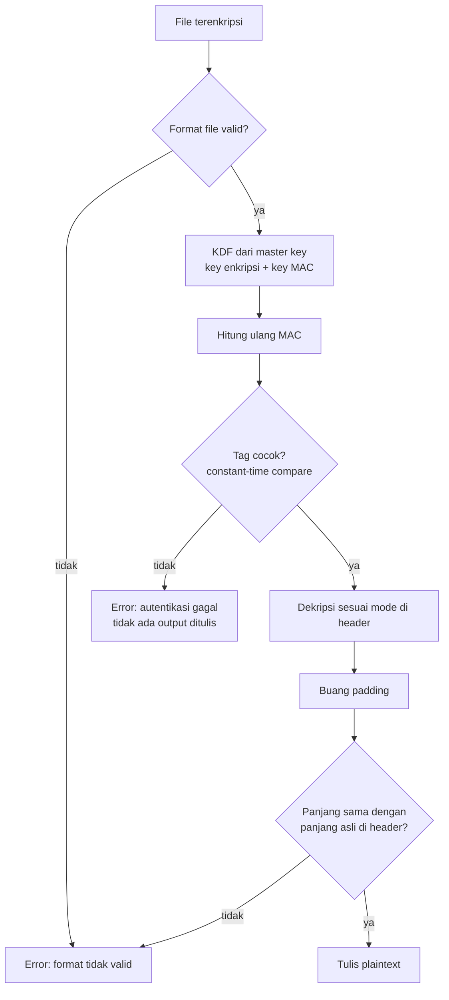

# Diagram 01: Alur Besar Enkripsi & Dekripsi File

Penjelasan: `docs/DESIGN.md` Bagian 1, 8, dan 9.

## Enkripsi

```mermaid
flowchart TD
    PT["Plaintext file (teks/biner)"] --> PAD["Padding PKCS#35;7"]
    MK["Master key"] --> KDF["KDF"]
    KDF --> KENC["Key enkripsi"]
    KDF --> KMAC["Key MAC"]
    IVSRC["IV dari user atau acak"] --> IV["IV / counter awal"]
    PAD --> MODE["Mode operasi<br/>ECB / CBC / CFB / OFB / CTR"]
    KENC --> MODE
    IV --> MODE
    MODE --> CT["Ciphertext"]
    IV --> HDR["Header<br/>magic, versi, mode, reserved, IV, panjang asli"]
    PT -. "panjang asli" .-> HDR
    HDR --> MAC["MAC (CMAC-TK)<br/>atas header + ciphertext"]
    CT --> MAC
    KMAC --> MAC
    MAC --> TAG["Tag"]
    HDR --> OUT["File output<br/>header + ciphertext + tag"]
    CT --> OUT
    TAG --> OUT
```

## Dekripsi

```mermaid
flowchart TD
    IN["File terenkripsi"] --> CHK{"Format file valid?"}
    CHK -- tidak --> E1["Error: format tidak valid"]
    CHK -- ya --> KDF["KDF dari master key<br/>key enkripsi + key MAC"]
    KDF --> MAC["Hitung ulang MAC"]
    MAC --> CMP{"Tag cocok?<br/>constant-time compare"}
    CMP -- tidak --> E2["Error: autentikasi gagal<br/>tidak ada output ditulis"]
    CMP -- ya --> DEC["Dekripsi sesuai mode di header"]
    DEC --> UNPAD["Buang padding"]
    UNPAD --> LEN{"Panjang sama dengan<br/>panjang asli di header?"}
    LEN -- tidak --> E1
    LEN -- ya --> OUT["Tulis plaintext"]
```
