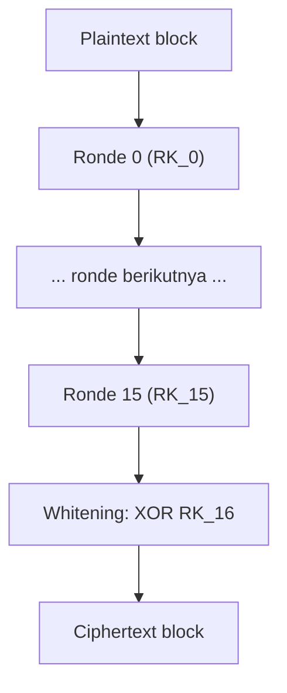
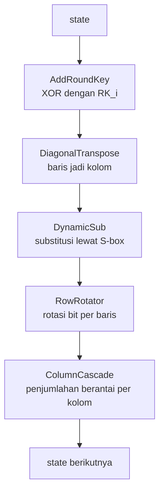
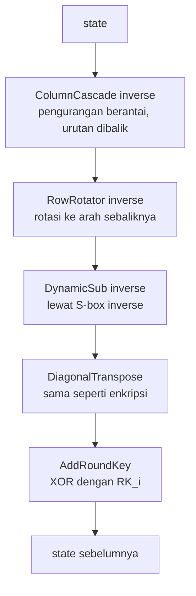
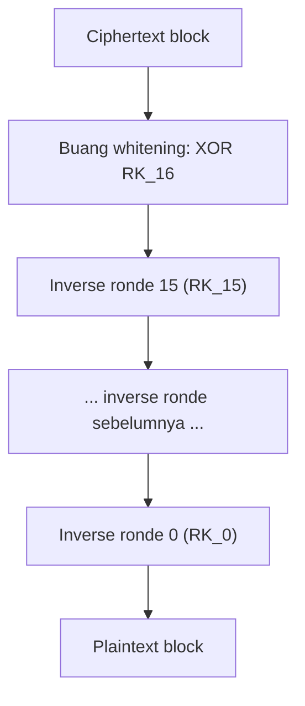

# Diagram 02: Cipher Core

Penjelasan: `docs/DESIGN.md` Bagian 3 dan 4.

## Enkripsi satu blok

```mermaid
flowchart TD
    P["Plaintext block"] --> R0["Ronde 0 (RK_0)"]
    R0 --> DOTS["... ronde berikutnya ..."]
    DOTS --> RN["Ronde 15 (RK_15)"]
    RN --> W["Whitening: XOR RK_16"]
    W --> C["Ciphertext block"]
```

## Isi satu ronde enkripsi

```mermaid
flowchart TD
    S0["state"] --> ARK["AddRoundKey<br/>XOR dengan RK_i"]
    ARK --> DT["DiagonalTranspose<br/>baris jadi kolom"]
    DT --> SUB["DynamicSub<br/>substitusi lewat S-box"]
    SUB --> ROT["RowRotator<br/>rotasi bit per baris"]
    ROT --> CC["ColumnCascade<br/>penjumlahan berantai per kolom"]
    CC --> S1["state berikutnya"]
```

## Isi satu ronde dekripsi (kebalikan)

```mermaid
flowchart TD
    S1["state"] --> ICC["ColumnCascade inverse<br/>pengurangan berantai, urutan dibalik"]
    ICC --> IROT["RowRotator inverse<br/>rotasi ke arah sebaliknya"]
    IROT --> ISUB["DynamicSub inverse<br/>lewat S-box inverse"]
    ISUB --> IDT["DiagonalTranspose<br/>sama seperti enkripsi"]
    IDT --> IARK["AddRoundKey<br/>XOR dengan RK_i"]
    IARK --> S0["state sebelumnya"]
```

## Dekripsi satu blok

```mermaid
flowchart TD
    C["Ciphertext block"] --> W["Buang whitening: XOR RK_16"]
    W --> RN["Inverse ronde 15 (RK_15)"]
    RN --> DOTS["... inverse ronde sebelumnya ..."]
    DOTS --> R0["Inverse ronde 0 (RK_0)"]
    R0 --> P["Plaintext block"]
```
