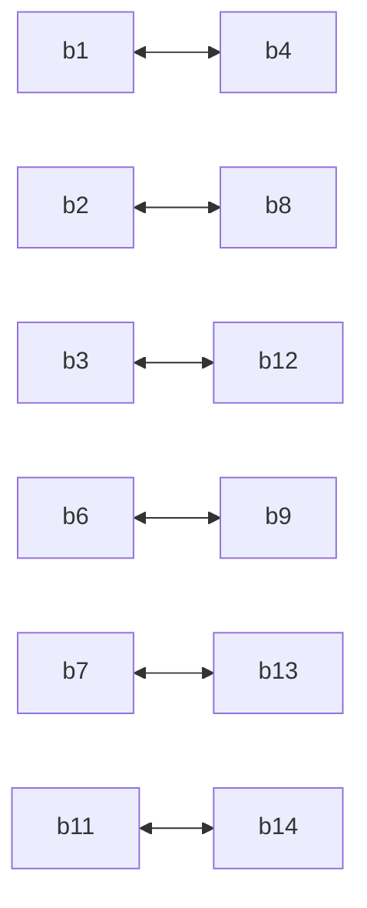
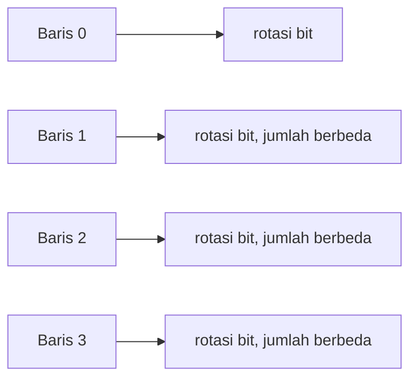
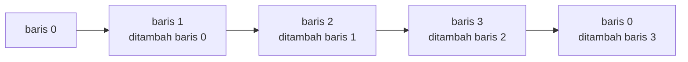

# Diagram 03: State dan Operasi di Dalam Ronde

Penjelasan: `docs/DESIGN.md` Bagian 2 dan 3.

## Layout state

Blok disusun baris demi baris menjadi matriks 4x4.

| baris \ kolom | 0   | 1   | 2   | 3   |
| ------------- | --- | --- | --- | --- |
| 0             | b0  | b1  | b2  | b3  |
| 1             | b4  | b5  | b6  | b7  |
| 2             | b8  | b9  | b10 | b11 |
| 3             | b12 | b13 | b14 | b15 |

## Arah kerja setiap operasi

## DiagonalTranspose

Byte di diagonal tetap di tempatnya. Byte lain bertukar dengan pasangannya di seberang diagonal.

## RowRotator

Setiap baris diperlakukan sebagai satu deretan bit dan dirotasi. Jumlah rotasi berbeda untuk setiap baris, sehingga bit berpindah melewati batas byte.

## ColumnCascade (satu kolom)

Byte dalam satu kolom dijumlahkan berantai dari atas ke bawah, lalu byte paling bawah ditambahkan kembali ke byte paling atas. Inverse-nya pengurangan dengan urutan dibalik.

