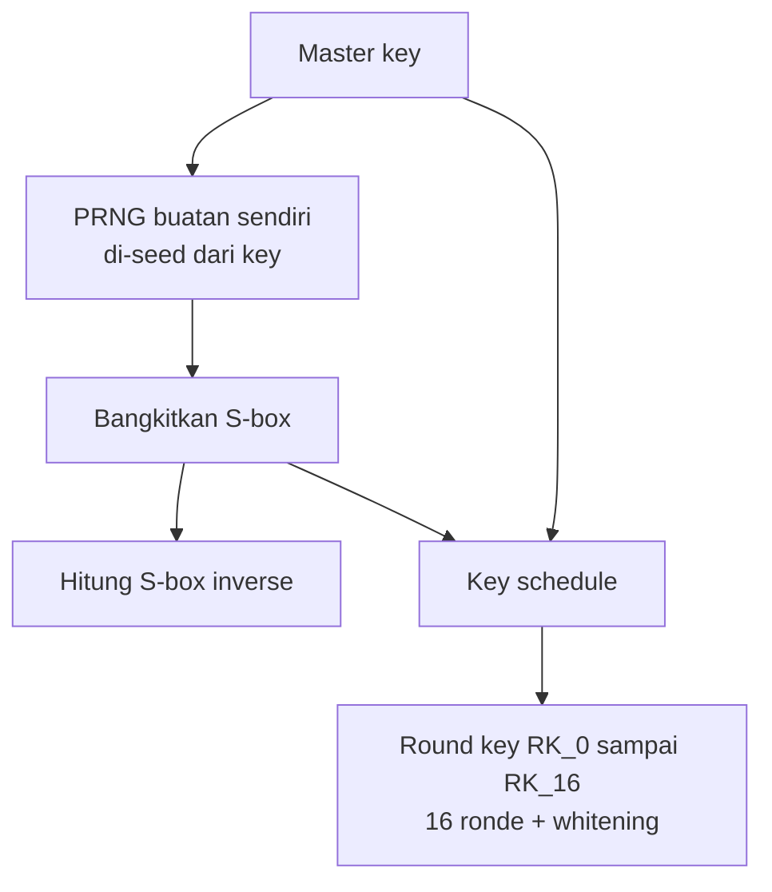
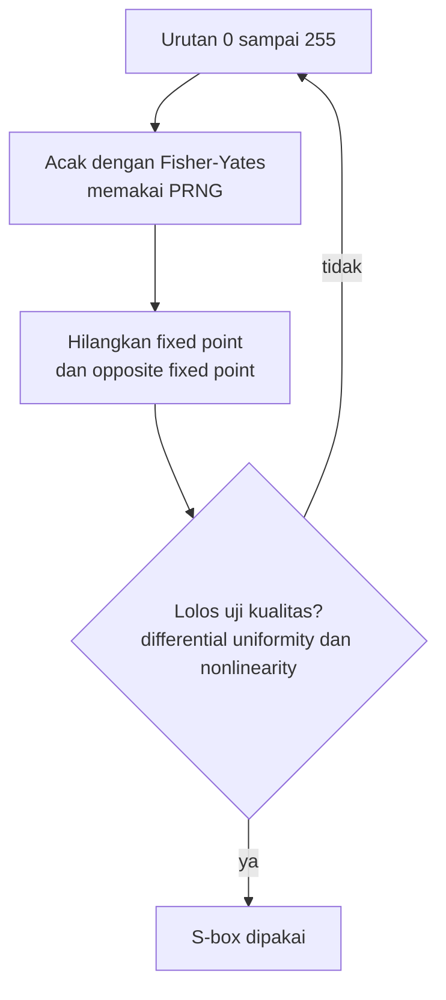
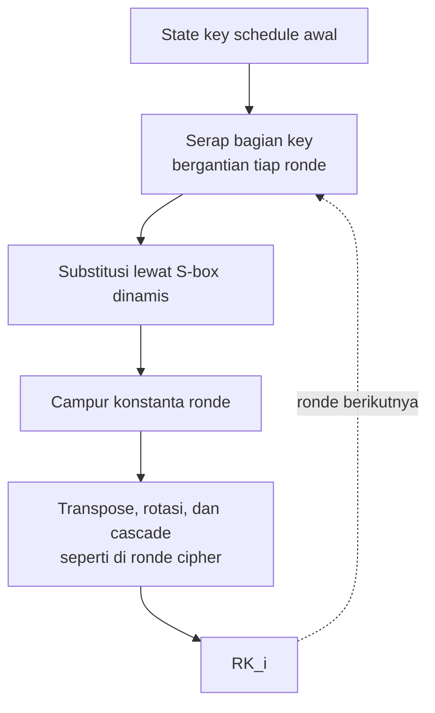

# Diagram 04: Key Setup

Penjelasan: `docs/DESIGN.md` Bagian 5.

## Urutan key setup

```mermaid
flowchart TD
    K["Master key"] --> PRNG["PRNG buatan sendiri<br/>di-seed dari key"]
    PRNG --> SBOX["Bangkitkan S-box"]
    SBOX --> INV["Hitung S-box inverse"]
    SBOX --> KS["Key schedule"]
    K --> KS
    KS --> RK["Round key RK_0 sampai RK_16<br/>16 ronde + whitening"]
```

## Pembangkitan S-box

```mermaid
flowchart TD
    START["Urutan 0 sampai 255"] --> FY["Acak dengan Fisher-Yates<br/>memakai PRNG"]
    FY --> FIX["Hilangkan fixed point<br/>dan opposite fixed point"]
    FIX --> Q{"Lolos uji kualitas?<br/>differential uniformity dan nonlinearity"}
    Q -- tidak --> START
    Q -- ya --> DONE["S-box dipakai"]
```

## Key schedule

```mermaid
flowchart TD
    T0["State key schedule awal"] --> ABS["Serap bagian key<br/>bergantian tiap ronde"]
    ABS --> SB["Substitusi lewat S-box dinamis"]
    SB --> RC["Campur konstanta ronde"]
    RC --> LIN["Transpose, rotasi, dan cascade<br/>seperti di ronde cipher"]
    LIN --> OUT["RK_i"]
    OUT -. "ronde berikutnya" .-> ABS
```
