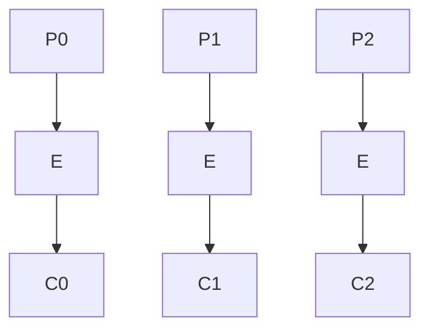
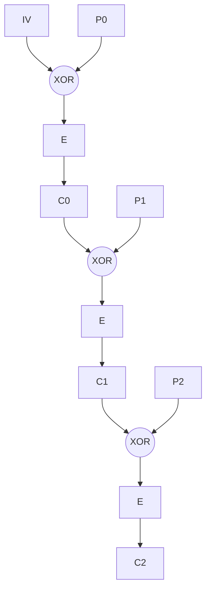
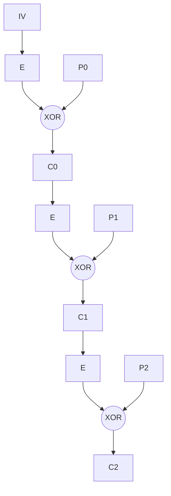
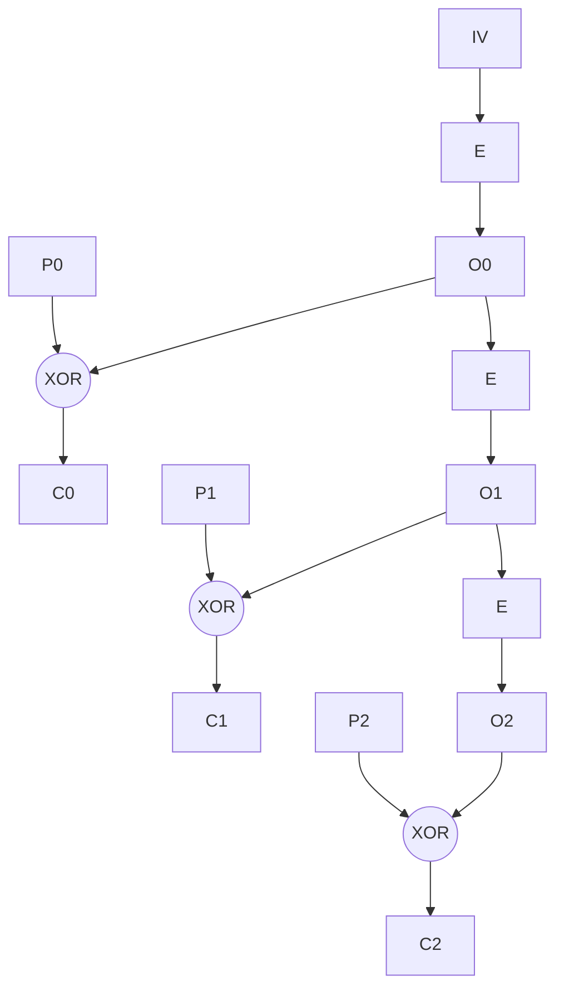
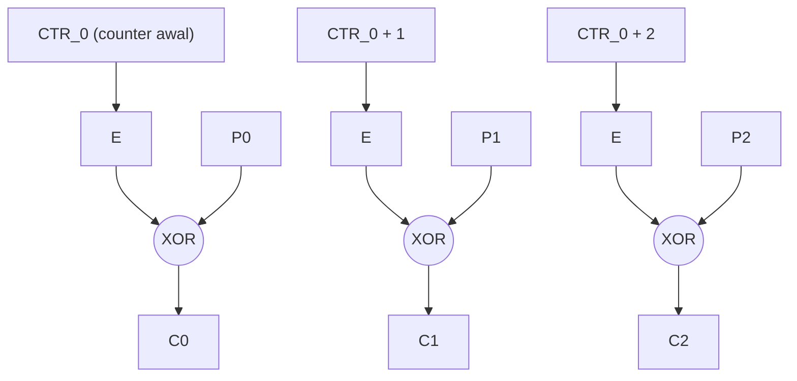

# Diagram 05: Mode Operasi

Penjelasan: `docs/DESIGN.md` Bagian 6. Rumus tiap mode ada di catatan di bawah diagramnya. `E` = enkripsi blok TK-Cipher berkunci key enkripsi, `D` = dekripsi blok. Indeks blok mulai dari 0.

## ECB

## CBC (enkripsi)

Dekripsi: `P_i = D(C_i) XOR C_(i-1)`, dengan `C_(-1) = IV`.

## CFB

Dekripsi: `P_i = C_i XOR E(C_(i-1))`. Hanya memakai `E`.

## OFB

Dekripsi sama persis, karena keystream tidak bergantung pada plaintext.

## CTR

Dekripsi sama persis. Counter adalah integer 128-bit, bertambah mod 2^128.
