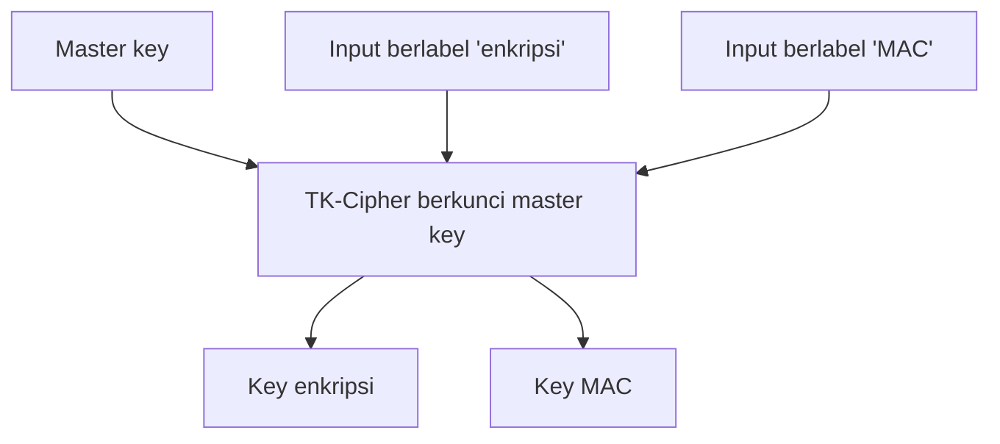
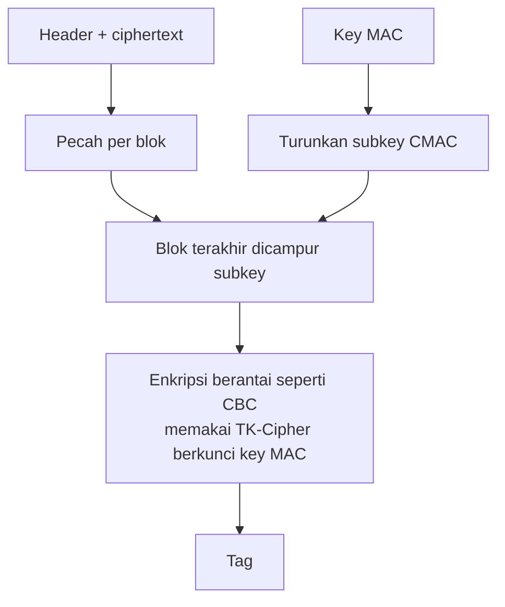
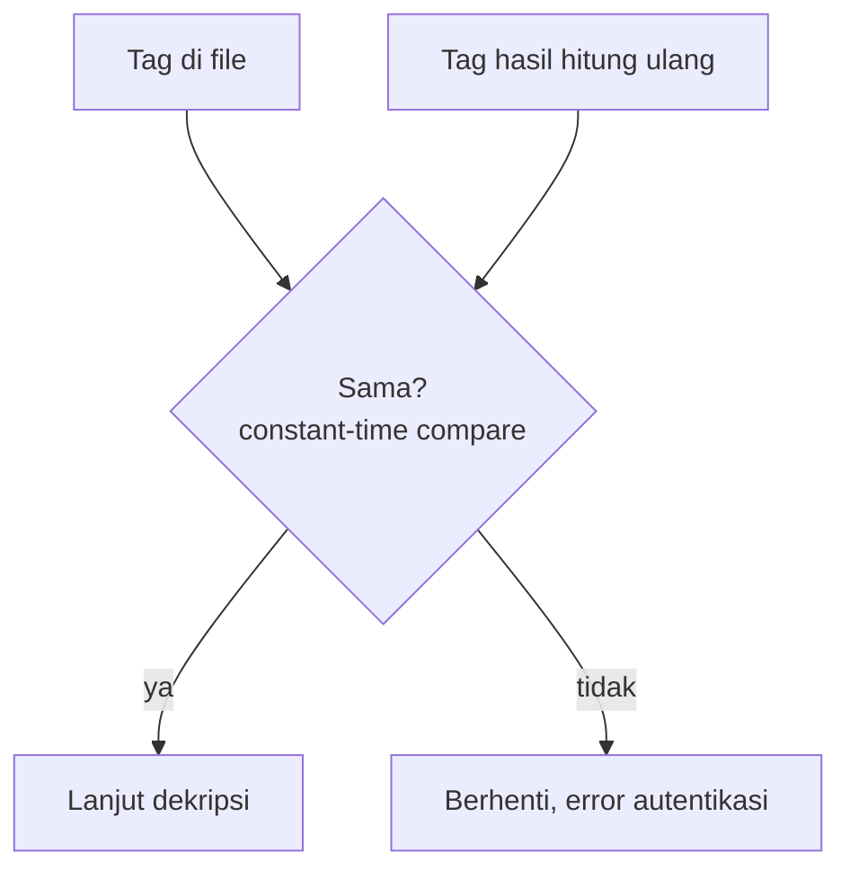

# Diagram 06: KDF dan MAC

Penjelasan: `docs/DESIGN.md` Bagian 8.

## KDF

Master key dipakai sebagai key TK-Cipher untuk mengenkripsi blok input yang berbeda (diberi label berbeda). Hasilnya menjadi dua key yang berbeda dan tidak saling berkaitan.

## MAC (CMAC dengan TK-Cipher)

## Verifikasi saat dekripsi

