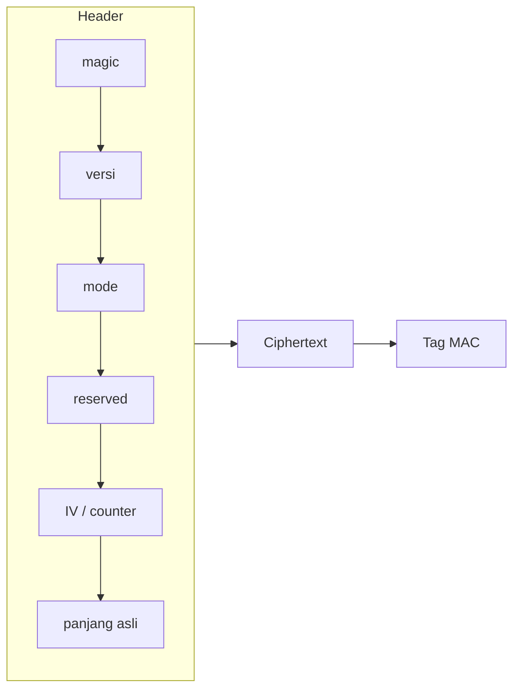
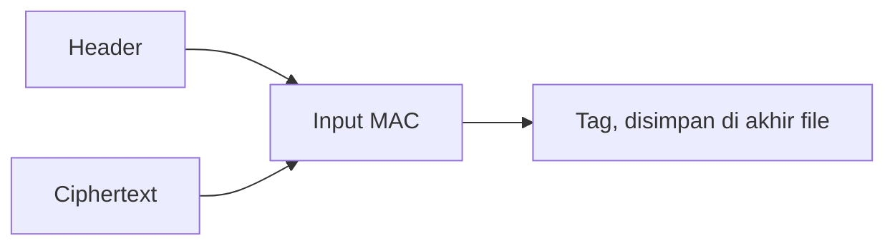
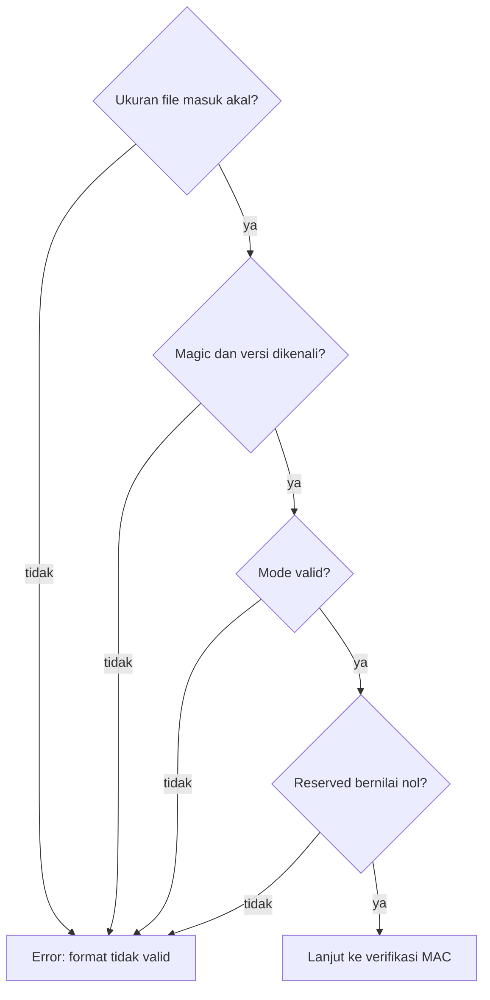

# Diagram 07: Format File Ciphertext

Penjelasan: `docs/DESIGN.md` Bagian 9. Ukuran dan posisi tiap field ada di `docs/blueprint.md`.

## Isi file

## Cakupan MAC

Semua isi header ikut di-MAC, jadi perubahan mode, IV, atau panjang juga terdeteksi.

## Validasi saat dekripsi

