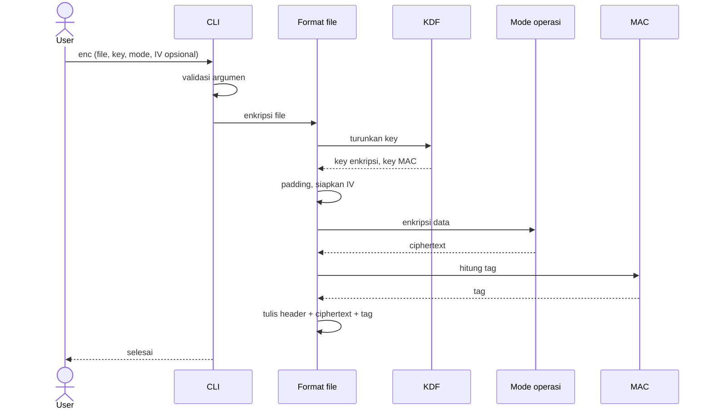
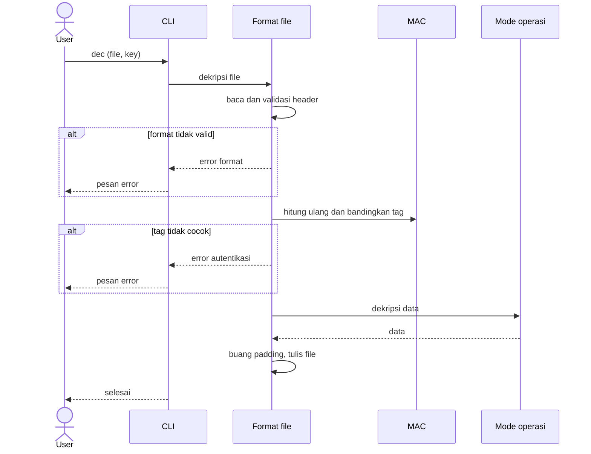
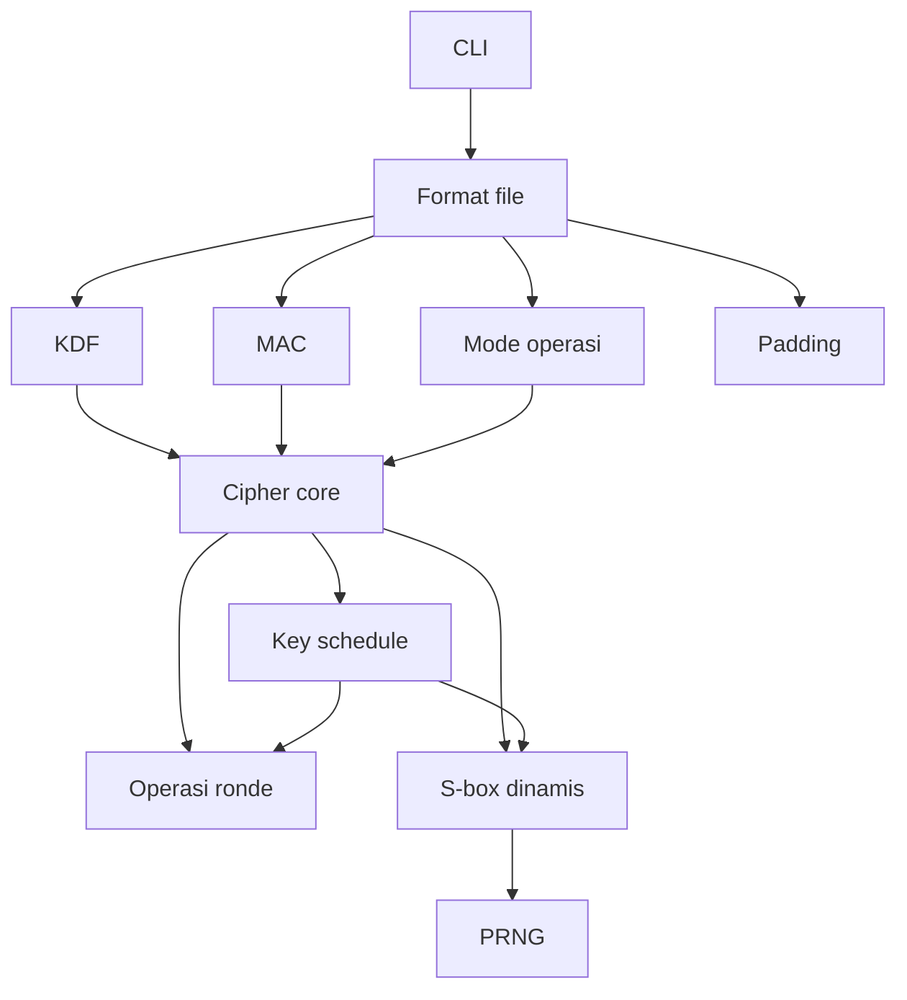

# Diagram 08: Alur Program dan Pembagian Modul

Penjelasan: `docs/DESIGN.md` Bagian 10.

## Alur enkripsi dari CLI

```mermaid
sequenceDiagram
    actor U as User
    participant CLI as CLI
    participant FF as Format file
    participant KDF as KDF
    participant MD as Mode operasi
    participant MAC as MAC
    U->>CLI: enc (file, key, mode, IV opsional)
    CLI->>CLI: validasi argumen
    CLI->>FF: enkripsi file
    FF->>KDF: turunkan key
    KDF-->>FF: key enkripsi, key MAC
    FF->>FF: padding, siapkan IV
    FF->>MD: enkripsi data
    MD-->>FF: ciphertext
    FF->>MAC: hitung tag
    MAC-->>FF: tag
    FF->>FF: tulis header + ciphertext + tag
    CLI-->>U: selesai
```

## Alur dekripsi dari CLI

```mermaid
sequenceDiagram
    actor U as User
    participant CLI as CLI
    participant FF as Format file
    participant MAC as MAC
    participant MD as Mode operasi
    U->>CLI: dec (file, key)
    CLI->>FF: dekripsi file
    FF->>FF: baca dan validasi header
    alt format tidak valid
        FF-->>CLI: error format
        CLI-->>U: pesan error
    end
    FF->>MAC: hitung ulang dan bandingkan tag
    alt tag tidak cocok
        FF-->>CLI: error autentikasi
        CLI-->>U: pesan error
    end
    FF->>MD: dekripsi data
    MD-->>FF: data
    FF->>FF: buang padding, tulis file
    CLI-->>U: selesai
```

## Pembagian modul

```mermaid
flowchart TD
    cli["CLI"] --> ff["Format file"]
    ff --> kdf["KDF"]
    ff --> mac["MAC"]
    ff --> modes["Mode operasi"]
    ff --> padding["Padding"]
    kdf --> cipher["Cipher core"]
    mac --> cipher
    modes --> cipher
    cipher --> ks["Key schedule"]
    cipher --> rounds["Operasi ronde"]
    cipher --> sbox["S-box dinamis"]
    ks --> rounds
    ks --> sbox
    sbox --> prng["PRNG"]
```
